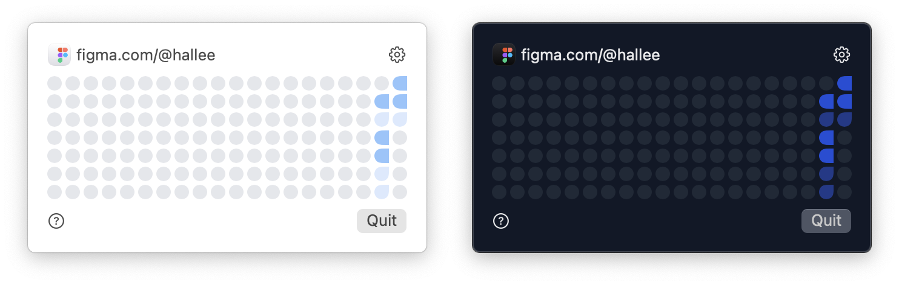
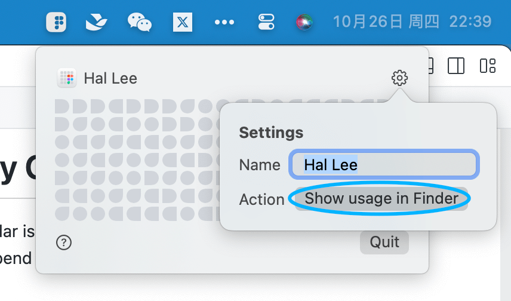

# Figma Activity Calendar

The Figma Activity Calendar is a menu application designed to monitor and track the amount of time you spend using Figma.

## How does it work?
This app will monitor when you activate the Figma window and how much time you spend in it. It will render a heatmap from this data.

All your data is stored in local. You can find it by clicking `Show usage in Finder` in the settings popover.

## What's the rules for tiles' color?
There are 5 levels for the color.
- **Level1**: less than 1 minutes (grey tile)
- **Level2**: more than 1 minutes but less than 30 minutes
- **Level3**: more than 30 minute but less than 3 hours
- **Level4**: more than 3 hours but less than 6 hours
- **Level5**: more than 6 hours
